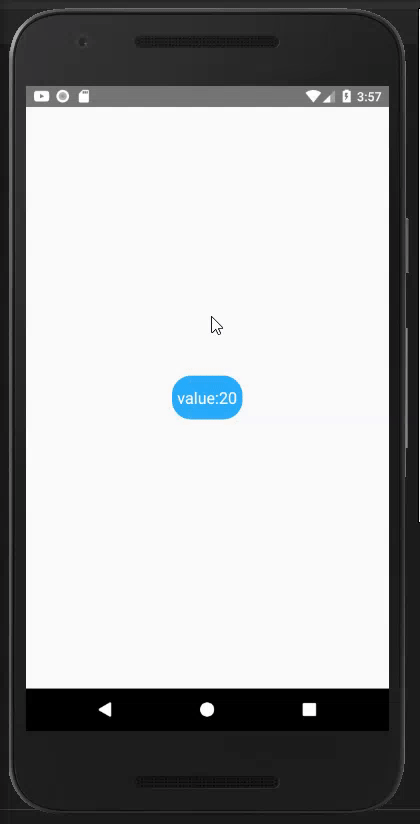

# rn_firebase_exp
A basic example of firebase usage with react-native
## How it works?
1. When the app runs at the begining, button title is: "loading" and button is disable , after it loads data from firestore button title is: "value: @readValueFromFirestore" and
button is clickable now.
2. At this point, when you press the button, it increases the value by one. We use the value that we had read before. We increase that local value by 1 and record that value to Firestore.
Then, we read it back and display it on the button again. So, we see these on the button, in order:
    - "saving" (disabled)
    - "loading" (disabled)
    - "value: @readValueFromFirestore" (enabled)
## How to Install 
1. You can use `git clone https://github.com/omereroglu/rn_firebase_exp` to download project to your computer or download it directly 
from `https://github.com/omereroglu/rn_firebase_exp` in zip format
2. Go to  directory you downloaded the project and run `npm install`
3. Since my "google-services.json" config is not available for you follow that [instructions](https://rnfirebase.io/) to create your own project connection config
4. While creating new project on firebase make sure you have collection name as "records", document as "the record" and field as "value" with; type: number, value: 0
5. After you added "google-services.json" config into your project as shown in instructions from firebase, run `npx react-native run-android`
## Demo

